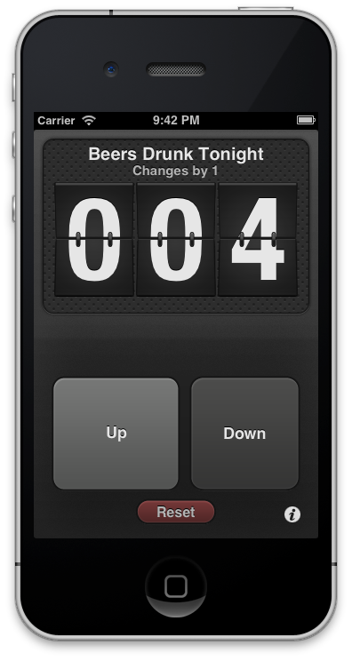

The Count
========

An iOS app for counting using flip digits.

My first iOS5/Storyboard project from '11.

## Features

* Multiple counters
* Counter naming
* Custom increment size
* Core Data to store history
* LEFT HAND MODE!
* an iAd (I was experimenting!)

## License
The Count is licenced under a [modified BSD License](https://github.com/ryanmaxwell/TheCount/blob/master/LICENSE). 
Please don’t upload this code directly to the App Store as is, without making substantial improvements. In other words, please don’t be a jerk.